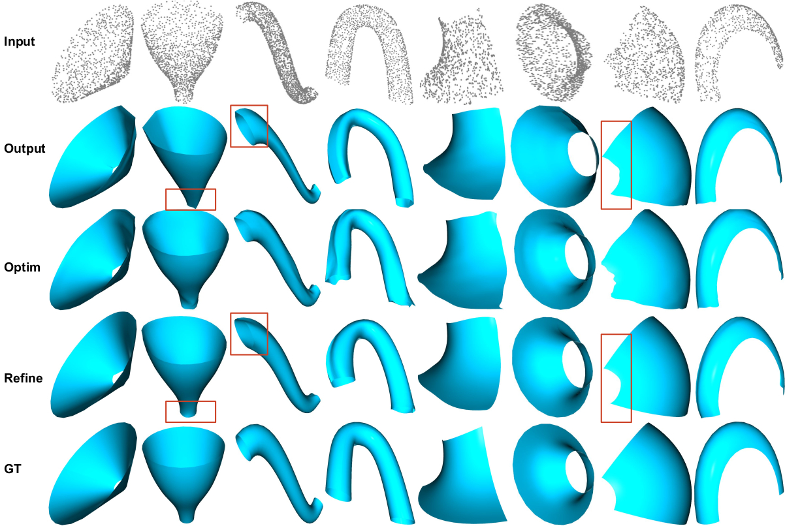
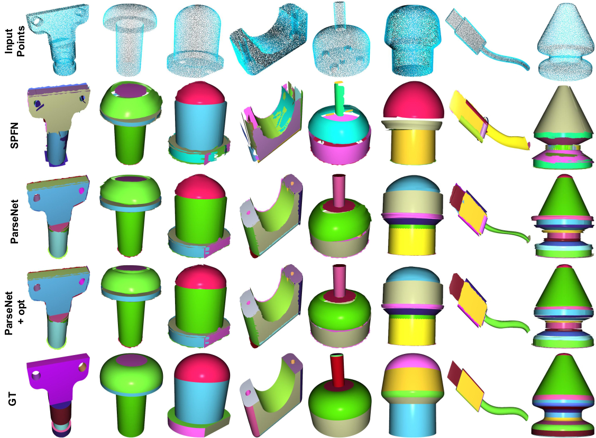

# ParSeNet: A Parametric Surface Fitting Network for 3D Point Clouds
Authors: [Gopal Sharma](https://hippogriff.github.io/), Difan Liu, Evangelos Kalogerakis, Subhransu Maji, Siddhartha Chaudhuri, Radomír Měch

**ECCV 2020**. [Paper](https://arxiv.org/pdf/2003.12181.pdf)

**Code and dataset are coming soon!**


ParSeNet decomposes point clouds (top row) into collections of seamlessly assembled parametric surface patches including B-spline patches (bottom row). On the right, a shape is edited using the inferred parametrization.

## Abstract
We propose a novel, end-to-end trainable, deep network called ParSeNet that decomposes a 3D point cloud into parametric surface patches, including B-spline patches as well as basic geometric primitives. ParSeNet is trained on a large-scale dataset of man-made 3D shapes and captures high-level semantic priors for shape decomposition. It handles a much richer class of primitives than prior work, and allows us to represent surfaces with higher fidelity. It also produces repeatable and robust parametrizations of a surface compared to purely geometric approaches. We present extensive experiments to validate our approach against analytical and learning-based alternatives.


## Method


**Overview of ParSeNet pipeline.** (1) The decomposition module takes a 3D point cloud (with optional normals) and decomposes it into segments labeled by primitive type. (2) The fitting module predicts parameters of a primitive that best approximates each segment. It includes a novel SplineNet to fit B-spline patches. The two modules are jointly trained end-to-end. An optional postprocess module refines the output.

## Results
### Differentiable Spline Fitting


**Qualitative evaluation of B-spline fitting.** From top to bottom: input point cloud, reconstructed surface by SplineNet,
reconstructed surface by \sn with post-processing optimization, reconstruction
by SplineNet with control point grid adjustment and finally ground truth surface.
Effect of post process optimization is highlighted in red boxes.

### Surface Fitting


Given the input point clouds with normals of the first row, we show  surfaces produced by SPFN (second row), ParSeNet without post-processing optimization (third row), and full ParSeNet including optimization (fourth row). The last row shows the ground-truth surfaces from our dataset.

## Citation
```
@misc{sharma2020parsenet,
    title={ParSeNet: A Parametric Surface Fitting Network for 3D Point Clouds},
    author={Gopal Sharma and Difan Liu and Evangelos Kalogerakis and Subhransu Maji and Siddhartha Chaudhuri and Radomír Měch},
    year={2020},
    eprint={2003.12181},
    archivePrefix={arXiv},
    primaryClass={cs.CV}
}
```
